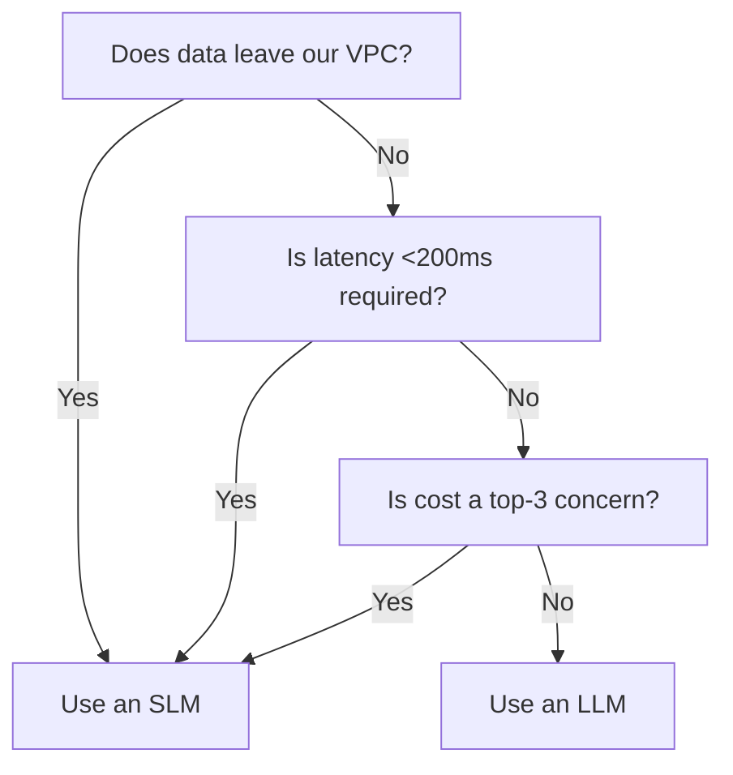

#  AI Platform — Engineering Playbook

*The single source of truth for how we build AI-powered developer tools.*

---

## What Is This?

This repository contains our **AI Project Playbook** — a living, collaborative guide to building the AI Platform. It covers the entire software development lifecycle, tailored for our unique stack.

> This playbook is an early-stage reference, not a turnkey product. Teams should adapt the guidance to their own workflows, compliance requirements, vendor agreements, and technology platforms.

- **AI/ML:** SLM training, prompt engineering, MCP toolset, RAG with pgvector, RDF knowledge graphs
- **Backend:** Python, FastAPI, Pydantic, LangChain, tree-sitter (also applicable to Node.js, .NET, Java, and other enterprise backends)
- **Frontend:** TypeScript, React, VS Code extension, Electron, Radix UI, Shadcn, Tailwind (also compatible with Next.js, Vue, and hybrid UI patterns)
- **Infrastructure:** GCP, AWS, OpenTofu (IaC), GitLab CI, Docker, Azure, on-prem hybrid patterns
- **Quality:** Kiwi TCMS, pytest, promptfoo, Playwright

---

## Why This Exists

> *"Simplicity is a choice. It's about unraveling the knots, not just hiding them."* — Rich Hickey

We build in a high-noise environment. This playbook is designed to:

- **Reduce cognitive load:** No guessing how to structure a PR or train an SLM.
- **Increase predictability:** A standardized release process eliminates chaos.
- **Preserve institutional knowledge:** Rotating roles (Release Manager, Dev Productivity) have clear runbooks.
- **Show signal, not noise:** Leadership gets concise updates, not firehoses of detail.

---

## Visual Decision Guide

New to AI Platform decisions? Start here.

> If you want, save this diagram as `assets/slm_vs_llm_decision_tree.png` for README embedding or community sharing.

## [Explore the Playbook World (Interactive Map)](https://bmrtech-oss.github.io/ai-development-playbook/)

## Quick Navigation

### 🚀 New Here? Start with Onboarding
- [`/docs/00-onboarding/developer_onboarding_guide.md`](docs/00-onboarding/developer_onboarding_guide.md)

### 🤖 AI Assistants (Cursor, Copilot, etc.)
- [`/AGENTS.md`](AGENTS.md) — Context and conventions for AI coding tools.

### 📚 Core Documentation by Phase

| Phase | Directory | Key Files |
|:------|:----------|:----------|
| **Discovery & Feasibility** | [`/docs/01-discovery/`](docs/01-discovery/) | `slm_vs_llm_decision_framework.md`, `ai_cost_modeling.md` |
| **Requirements & Grooming** | [`/docs/02-requirements/`](docs/02-requirements/) | `jira_to_github_workflow.md` |
| **Design & Architecture** | [`/docs/03-design/`](docs/03-design/) | `adr/` (Architecture Decision Records) |
| **Development** | [`/docs/04-development/`](docs/04-development/) | `python_guidelines.md`, `frontend_vscode_guidelines.md`, `slm_training_guidelines.md`, `model_versioning_registry.md`, `mcp_design_and_development.md`, `dependency_governance.md`, `troubleshooting.md`, `conventions/ai_code_review_checklist.md` |
| **Testing & QA** | [`/docs/05-testing/`](docs/05-testing/) | `testing_lifecycle_maturity.md`, `qa_strategy_noise_vs_signal.md`, `slm_evaluation_harness.md`, `e2e_testing_strategy.md` |
| **Deployment & CI/CD** | [`/docs/06-deployment/`](docs/06-deployment/) | `azure_onprem_guide.md`, `aws_onprem_guide.md`, `gitlab_ci_opentofu_guide.md`, `security_scanning.md` |
| **Operations** | [`/docs/07-operations/`](docs/07-operations/) | `operations_maturity.md`, `incident_response_runbook.md`, `monitoring_and_alerting.md`, `data_privacy_and_security.md`, `mcp_observability_playbook.md`, `knowledge_graph_maintenance.md`, `observability/rag_hygiene_dashboard.md` |
| **Governance & Compliance** | [`/docs/08-governance/`](docs/08-governance/) | `model_card_template.md` |
| **Team & Organization** | [`/docs/team/`](docs/team/) | `lean_team_design.md`, `communication_bandwidth_management.md` |
| **Playbooks (Role-Specific)** | [`/docs/playbooks/`](docs/playbooks/) | `tech_lead_release_checklist.md`, `leadership_update_template.md` |

### 🎯 Making It Real
- [`/ROADMAP.md`](ROADMAP.md) — Concrete actions, owners, and timelines.

---

## Core Tenets (Signal Over Noise)

1. **Trunk-Based & Feature Flags:** Deploy code often, release features carefully.
2. **Evaluate AI Like Unit Tests:** If you can't measure it, you can't ship it.
3. **End-to-End Ownership:** You build it, you run it.
4. **Unix Philosophy:** Small, sharp tools over large frameworks.
5. **Assume Good Intent:** Bandwidth is a team responsibility, not an individual burden.

---

## How to Contribute

This playbook belongs to **all of us**. It's not a static decree.

- **Quick thoughts or questions?** Use the **#eng-process** Slack channel.
- **Concrete changes?** Open a PR against this repository. Treat process changes with the same rigor as code changes.
- **Bigger discussions?** Bring it up in the monthly Architecture Forum.

## Recommended Next Actions

- Enable GitHub Discussions in repository settings so the `show_and_tell` template is active.
- Cross-link `AWESOME.md`, `STARTER_KITS.md`, and `quickstart/slm-eval-template/README.md` from the main README.
- Render the Mermaid decision tree as `assets/slm_vs_llm_decision_tree.png` for better shareability.
- Announce the AI Code Review Checklist and quickstart guide in community forums or dev.to.
- Add a short `ROADMAP.md` entry for community onboarding and shareable documentation.

See [`/docs/CONTRIBUTING.md`](docs/CONTRIBUTING.md) for detailed guidelines.

---

## Versioning

This playbook follows [Semantic Versioning](https://semver.org/).

- **Major:** Significant process overhaul or org structure change.
- **Minor:** New section, tool adoption, or expanded guideline.
- **Patch:** Clarifications, typo fixes, small improvements.

Current version: `1.0.0`

---

## Playbook Health & Adoption

| Aspect | Status | Last Check | Owner |
|--------|:------:|:----------:|-------|
| All docs dated & updated | ✅ 100% | 2026-04-18 | @platform-team |
| Security scanning in CI | ✅ Active | 2026-04-18 | @sre |
| On-call rotation live | ✅ Active | 2026-04-18 | @eng-ops |
| Model versioning setup | ✅ Active | 2026-04-18 | @ml-team |
| E2E testing framework | ✅ Implemented | 2026-04-18 | @qa-team |
| Monitoring & alerting | ✅ Active | 2026-04-18 | @sre |
| Last incident postmortem | ✅ 2026-04-10 (48h SLA met) | — | — |
| Mean onboarding time | ✅ 3 days | 2026-04-18 | @eng-lead |
| Incident response drills | ✅ Q4 2026 scheduled | 2026-04-18 | @eng-ops |

**This playbook is live and actively maintained.** Updates are merged weekly. [View change log](ROADMAP.md).

---

## Maintainers

- [bmrtech-oss] — [contributor]
- [bmrtech@myyahoo.com] — [contributor]

*This list is the current "Kernel Team" responsible for curating the playbook. It rotates quarterly.*

---

*"Managing the noise so we can focus on the signal."*
