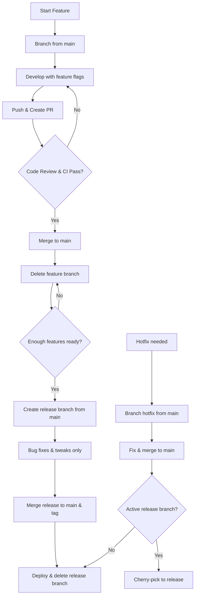

# Git Branching Strategy

## Overview
This repository follows a simplified Git branching strategy based on GitHub Flow, enhanced with explicit release branches and feature flags for handling unfinished code. Unlike complex workflows like Git Flow, this approach keeps things simple while ensuring `main` remains always deployable (production-ready). Feature flags allow merging incomplete work safely, enabling continuous integration without blocking releases.

## Branching Model & Naming Conventions
We use the following branch types with consistent naming patterns:

- **Feature branches**: `feature/<short-description>` (e.g., `feature/add-auth`, `feature/improve-slm-training`)
- **Release branches**: `release/<version>` (e.g., `release/v1.2.0`, `release/v2.0.0-beta`)
- **Hotfix branches**: `hotfix/<description>` (e.g., `hotfix/fix-login-error`, `hotfix/patch-security-vuln`)
- **Main branch**: `main` (protected, no direct commits—always deployable)

All branches must follow these patterns. Use lowercase, hyphens for separators, and keep descriptions concise (under 50 characters).

## Workflow Steps

1. **Starting a feature**:
   - Branch from `main`: `git checkout -b feature/add-auth`
   - Develop incrementally, using feature flags to hide incomplete functionality.
   - Push early and often for collaboration: `git push origin feature/add-auth`

2. **Merging a feature**:
   - Merge to `main` via pull request at any time, even if unfinished, as long as new behavior is disabled by a feature flag.
   - Require code review and CI checks before merging.
   - Delete the feature branch after merging.

3. **Creating a release**:
   - When sufficient features are ready (flags enabled in staging), branch `release/<version>` from `main`: `git checkout -b release/v1.2.0`
   - Tag the branch start for traceability.

4. **Release branch changes**:
   - Only allow bug fixes, documentation updates, and last-minute tweaks—no new features.
   - All changes must be merged back to `main` immediately to keep branches in sync.

5. **Releasing**:
   - After final testing and flag cleanup, merge `release/<version>` to `main`.
   - Tag the merge commit with the version: `git tag v1.2.0`
   - Deploy from `main` and delete the release branch.

6. **Hotfixes**:
   - Branch from `main`: `git checkout -b hotfix/fix-critical-bug`
   - Fix the issue and merge back to `main`.
   - If a release branch exists, cherry-pick or merge the fix there as well.

## Workflow Diagram

The following Mermaid diagram illustrates the branching workflow:



## Feature Flags for Unfinished Code
Feature flags enable merging incomplete features to `main` without impacting production, supporting continuous integration and early feedback.

### Why Use Feature Flags?
- Keep `main` deployable by toggling unfinished code.
- Allow parallel development and testing of experimental features.
- Reduce merge conflicts from long-lived branches.
- Flags are short-lived—remove them once features are stable and released.

### Implementation Guidance
- **Configuration-based**: Use environment variables (e.g., `FEATURE_X_ENABLED=true`) or config files (e.g., JSON/YAML).
- **Code-level toggles**: Wrap new code in conditional checks.
- **Management**: Store flags in a central config; use tools like LaunchDarkly or simple env vars for smaller projects.

### Example (TypeScript)
```typescript
// config/featureFlags.ts
export const featureFlags = {
  isEnabled: (flag: string): boolean => {
    return process.env[`FEATURE_${flag.toUpperCase()}_ENABLED`] === 'true';
  }
};

// Usage in code
if (featureFlags.isEnabled('new-ui')) {
  // Render new UI component
} else {
  // Fallback to old UI
}
```

### Example (Python)
```python
import os

def is_feature_enabled(flag: str) -> bool:
    return os.getenv(f"FEATURE_{flag.upper()}_ENABLED", "false").lower() == "true"

# Usage
if is_feature_enabled("slm_training"):
    # Enable new training logic
    pass
```

Remove flags after full rollout and testing.

## Branch Naming Cheatsheet
| Branch Type | Prefix | Example | Purpose |
|-------------|--------|---------|---------|
| Feature | `feature/` | `feature/add-auth` | New features or enhancements |
| Release | `release/` | `release/v1.2.0` | Prepare and finalize releases |
| Hotfix | `hotfix/` | `hotfix/fix-login-error` | Urgent production fixes |
| Main | N/A | `main` | Production-ready code |

## Useful Git Hooks
Git hooks automate checks and enforce standards. Use pre-commit hooks to prevent common issues.

### Recommended Hooks
- **pre-commit**: Run linting, formatting, and tests before commits.
  - Example: Use `pre-commit` framework with hooks for `black` (Python), `eslint` (TypeScript), and `ruff`.
- **commit-msg**: Enforce conventional commit messages (e.g., `feat: add auth`).
  - Install via `pre-commit install --hook-type commit-msg`.
- **pre-push**: Run full test suite before pushing to remote.

### Setup Example
```bash
# Install pre-commit
pip install pre-commit
pre-commit install

# .pre-commit-config.yaml example
repos:
  - repo: https://github.com/pre-commit/pre-commit-hooks
    rev: v4.4.0
    hooks:
      - id: trailing-whitespace
      - id: end-of-file-fixer
  - repo: https://github.com/psf/black
    rev: 22.3.0
    hooks:
      - id: black
```

## Pull Request Structure Guidelines
Pull requests (PRs) should be clear, focused, and review-friendly. Use the following structure for consistency.

### PR Template
- **Title**: Concise, e.g., `feat: add user authentication`
- **Description**:
  - **What**: Brief summary of changes.
  - **Why**: Rationale and business impact.
  - **How**: Implementation details, feature flags used.
  - **Testing**: How to test, including flag toggles.
  - **Screenshots/Demos**: For UI changes.
- **Checklist**:
  - [ ] Feature flag added/updated?
  - [ ] Tests pass locally?
  - [ ] Docs updated?
  - [ ] Breaking changes noted?

### Best Practices
- Keep PRs small (under 400 lines, per repo guidelines).
- Reference issues (e.g., `Closes #123`).
- Use draft PRs for WIP features.
- Require at least one approval before merging.
- Squash merges for feature branches to keep history clean.

## Branch Protection and CI/CD
To enforce quality, configure branch protections on `main`:

- Require PR reviews (at least 1-2 approvers).
- Require status checks (CI tests, linting) to pass.
- Prevent force pushes and deletions.
- Use GitHub branch protection rules or equivalent in other platforms.

### CI/CD Integration
- Run automated tests on every PR and push to `main`.
- Use feature flags in CI to test toggled features.
- Automate releases: Tag on merge to `main`, trigger deployments.
- Example GitHub Actions workflow snippet:
  ```yaml
  name: CI
  on: [push, pull_request]
  jobs:
    test:
      runs-on: ubuntu-latest
      steps:
        - uses: actions/checkout@v3
        - name: Run tests
          run: npm test  # or python -m pytest
  ```

## Quick Start & Resources

### Getting Started

1. **New to the project?** See [examples/branching-workflow-examples.md](examples/branching-workflow-examples.md) for practical examples of common workflows.
2. **Setting up your local environment?** Follow [examples/git-hooks-ci-cd-setup.md](examples/git-hooks-ci-cd-setup.md) to install Git hooks and enable automation.
3. **Need a quick reference?** Jump to [Branch Naming Cheatsheet](#branch-naming-cheatsheet) below.

### Automated Enforcement

The following tools enforce this branching strategy automatically:

- **Git Hooks** (`.pre-commit-config.yaml`) – Local validation before commits
  - Branch name format checking
  - Commit message validation
  - Feature flag detection
  - File formatting and linting

- **GitHub Actions** (`.github/workflows/branching-strategy-enforcement.yml`) – Cloud-based checks on PRs and pushes
  - Branch name validation
  - Conventional commit verification
  - PR structure checks
  - Test automation based on changed files

- **GitLab CI** (`quickstart/gitlab-ci-pipeline.yml`) – Extended CI/CD pipeline
  - Branch validation and hotfix alerts
  - Release branch safeguards
  - Deployment stages (staging, E2E, production)
  - Feature flag integration

### Helper Scripts

- `scripts/validate_branch_name.py` – Validate branch naming conventions
- `scripts/check_feature_flags.py` – Detect orphaned feature flags

## Rationale
This hybrid approach (GitHub Flow + release branches + feature flags) suits an AI development playbook by prioritizing simplicity, continuous integration, and production stability. It avoids the complexity of Git Flow while allowing structured releases for AI/ML projects that may require careful versioning (e.g., model updates). Feature flags are particularly valuable for experimental AI features, enabling safe iteration without disrupting `main`. Always refer to `CONTRIBUTING.md` for commit message standards.